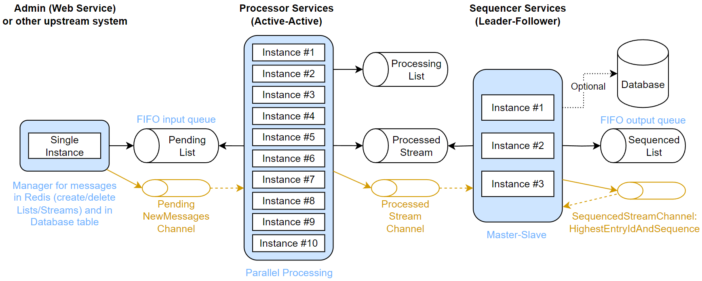
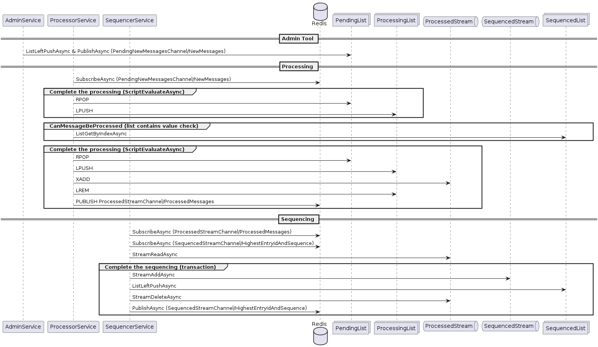

# Resilient, Performant, and Scalable Message Processing System

## Challenge
Design and implement a message processing system that is resilient, performant, and scalable. The system should be able to handle a high volume of messages while maintaining the original sequence order of the messages.

## Flow
1. Retrieve messages one by one from an input queue
2. Process messages in parallel
3. Update the system of record for each message
4. Write messages to an output queue

## Constraints
1. Messages must be processed in their incoming order
2. The sequence order must be maintained when outgoing

## Tests
1. Start multiple services for parallel processing
2. Prepare hundreds of messages in an input queue
3. Each message has at least an unique sequence number and a small payload
4. Long processing time will be simulated by waiting for 500 ms

## Verifications
1. Order is preserved by confirming output sequence is the same as the input
2. System can recover fast for process and connection failures
3. No messages are lost or duplicated even when disruptions occur
4. Time elapsed when all messages are generated at once (burst mode / load test)
5. Time elapsed when messages are generated at a sustainable processing rate (soak test)

## Implementation choices
1. ElastiCache Serverless Redis providing 99.99% availability SLA
2. Develop clients in C# .NET Core 8.0 referencing StackExchange.Redis and Npgsql libraries
3. Deploy multiple active-active instances of a Processing service reading from an input List and writing to a Stream
4. Deploy a few master-slave instances of a Sequencing service reading from the Stream and writing to an output List
5. Implement master-slave with a distributed lock in Redis having expiry time of 1 second allowing very fast switch
6. Keep the slaves constantly ready to be master and continuously requesting ownership of the distributed lock
7. Utilize Redis Pub/Sub with channels to limit short polling requests
8. Leverage Lua scripts and transactions to ensure good performances
9. Implement idempotency in Redis for performance considerations
10. Use Redis as main system of record, although switching to PostgreSQL database is possible
11. On top of sequence number and payload, message format includes creating, processing, processed, sequencing, and sequenced datetimes to easily calculate performance statistics

## Potential improvements
1. Processing service handling multiple messages in parallel
2. Partitioning/Sharding the input queue and channels based on the message sequence number
3. Enhance security (note this is a PoC and much more is required to release to production)
4. Implement robust monitoring to identify faster the bottlenecks

## By relaxing the ordering constraint
1. Remove the Sequencing service to significantly increase performance
2. Create a Dead Letter Queue when processing fails a few time or encounter specific exceptions

## Important files

Processor Service
- [Processor.cs](Services/ProcessorService/Processor.cs)
- [PendingListToProcessedListListener.cs](DataAccessLayers/RedisAccessLayer/Client/PendingListToProcessedListListener.cs)

Sequencer Service
- [Sequencer.cs](Services/SequencerService/Sequencer.cs)
- [ProcessedListToSequencedListListener.cs](DataAccessLayers/RedisAccessLayer/Client/ProcessedListToSequencedListListener.cs)

Locks
- [NativeLock.cs](DataAccessLayers/RedisAccessLayer/Locks/NativeLock.cs) for normal Redis
- [AtomicCustomLock.cs](DataAccessLayers/RedisAccessLayer/Locks/AtomicCustomLock.cs) for AWS ElastiCache Serverless Redis

## Diagrams

### Architecture

1. The input FIFO queue (Pending List) is where messages are stored and retrieved by the processors
2. The Processor services (Active-Active) perform parallel processing of messages from the input FIFO queue (can be scaled as needed) then write processed messages to a Processed Stream
3. The Sequencer services (Active-Standby/Masters-Slave) are responsible for maintaining the original sequence order of the messages. They read messages from the Processed Stream and write them to an output FIFO queue (Sequenced List), ensuring the original sequence order is preserved
4. Operations on Lists and Streams are follow by the publication of events on channels to avoid many unwanted short pollings requests by services
5. A database can be used as the system of record for storing processed messages (much slower than saving into Redis so it has been made optional)

### Sequence

This sequence diagram represents the interactions and flow of messages between services and Redis for storage and communication.

*Admin Tool*

1. The AdminService sends messages to the PendingList using the `ListLeftPushAsync` operation
2. It also publishes a notification to the `PendingNewMessagesChannel/NewMessages` channel using `PublishAsync`

*Processing*

1. The ProcessorService subscribes to the `PendingNewMessagesChannel/NewMessages` channel to receive notifications about new messages
2. It performs the following steps in the "Complete the processing" group using `ScriptEvaluateAsync`:
   - Removes the message from the PendingList using `RPOP`
   - Adds the message to the ProcessingList using `LPUSH`
3. Before processing a message, it checks if the message can be processed in the "CanMessageBeProcessed" group by retrieving the corresponding value from the SequencedList using `ListGetByIndexAsync`
4. If the message can be processed, the ProcessorService performs the following steps in the "Complete the processing" group using `ScriptEvaluateAsync`:
   - Removes the message from the PendingList using `RPOP`
   - Adds the message to the ProcessingList using `LPUSH`
   - Processes the message and adds it to the ProcessedStream using `XADD`
   - Removes the message from the ProcessingList using `LREM`
   - Publishes a notification to the `ProcessedStreamChannel/ProcessedMessages` channel using `PUBLISH`

*Sequencing*

1. The SequencerService subscribes to two channels:
   - `ProcessedStreamChannel/ProcessedMessages` to receive notifications about processed messages
   - `SequencedStreamChannel/HighestEntryIdAndSequence` to receive notifications about the highest sequenced entry ID
2. It reads the processed messages from the ProcessedStream using `StreamReadAsync`
3. To maintain the original order, the SequencerService performs the following steps in the "Complete the sequencing" group using a transaction:
   - Adds the message to the SequencedStream using `StreamAddAsync`
   - Adds the message to the SequencedList using `ListLeftPushAsync`
   - Deletes the message from the ProcessedStream using `StreamDeleteAsync`
   - Publishes the highest entry ID and sequence to the `SequencedStreamChannel/HighestEntryIdAndSequence` channel using `PublishAsync`

The diagram shows the flow of messages from the AdminService to the PendingList, then to the ProcessorService for processing. The processed messages are added to the ProcessedStream and then sequenced by the SequencerService. The SequencerService maintains the original order of messages and adds them to the SequencedStream and SequencedList.

The use of publish/subscribe channels allows for communication and coordination between the services. The ProcessorService subscribes to the PendingNewMessagesChannel/NewMessages channel to receive notifications about new messages, while the SequencerService subscribes to the ProcessedStreamChannel/ProcessedMessages and SequencedStreamChannel/HighestEntryIdAndSequence channels to receive notifications about processed messages and the highest sequenced entry ID, respectively.

## Medium article

[Resilient, Performant, and Scalable Message Processing System](https://medium.com/@claude.ducharme/resilient-performant-and-scalable-message-processing-system-6d7e74706d75)
